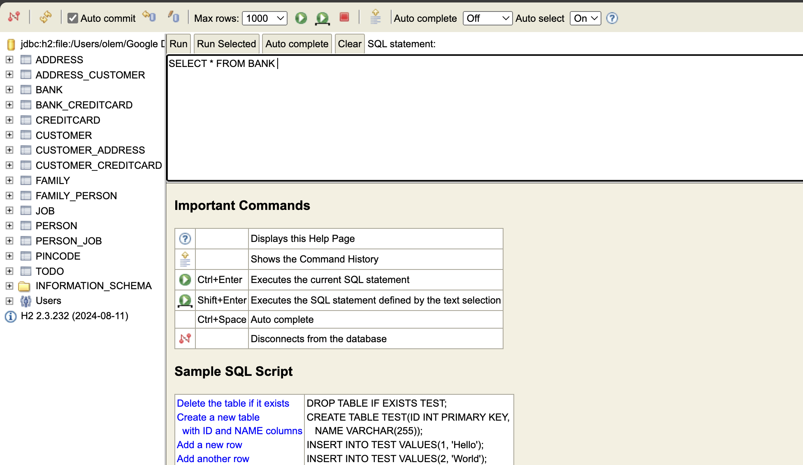

# Assignment 4

Author: Ole Magnus Fon Johnsen

## Experiment 1

The first experiment went well. All the tests are passing. Seems like the JUnit version was a bit outdated in the tutorial so I had to update the `@Before` block to use `@BeforeEach` instead. And use `assertThrows` instead of `@Test(expected = Exception.class)`.

### Questions

1. Can you find out which database is used and where the database stores its files?

   It uses `H2` as the database and it is stored in `./DB.mv.db`.

## Experiment 2

The second experiment also went well. After having done the first the second one was not that difficult.

### Questions

1. Explain the used database and how/when it runs.

   Same as the first experiment, it uses `H2` and is stored in `./DB.mv.db`. It runs when the application is started.

2. Can you provide the SQL used to create the table Customer?

   We can have a look at the `DB.trace.db` file to see the SQL used to create the table. The SQL is as follows:

   ```sql
   create table Customer (
       id bigint generated by default as identity,
       name varchar(255),
       primary key (id)
   )
   ```

3. Find a way to inspect the database tables being created and create a database schema in your report. Do the created tables correspond to your initial thoughts regarding the exercise?

   This is kind of tricky to do compared to other databases I think, but you could download the H2 jar from the offical website to inspect the database with either the GUI or the shell. The tables created correspond to my initial thoughts regarding the exercise. I connected with the URL: `jdbc:h2:file:<path to DB>`.

## Technical problems

I did not encounter any technical problems during this assignment.

## Experiment 2 link

You can see experiment 2 [here](./src/test/java/no/hvl/dat250/jpa/tutorial/relationshipexample/JpaTest.java)

## Screenshot of inspecting the database with the H2 GUI


